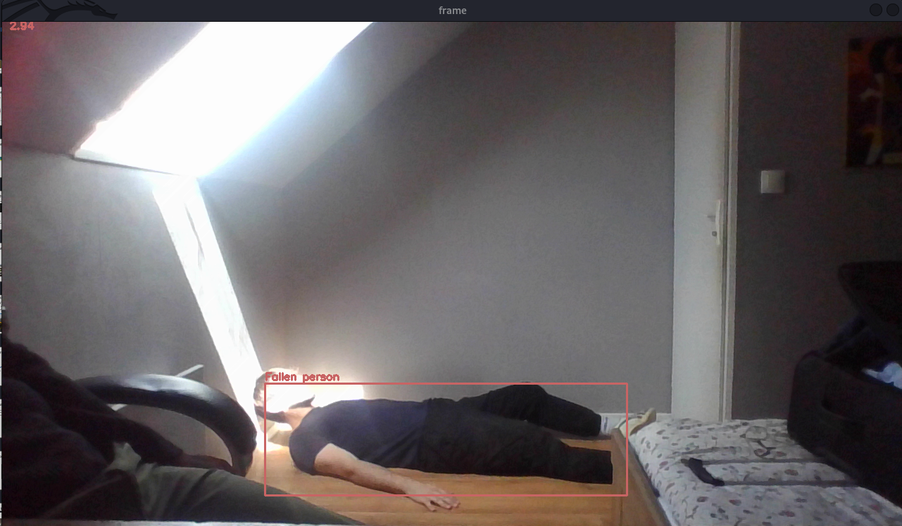
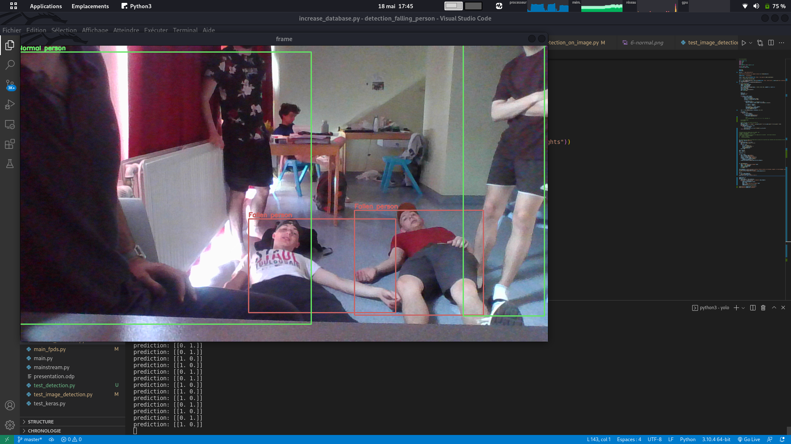
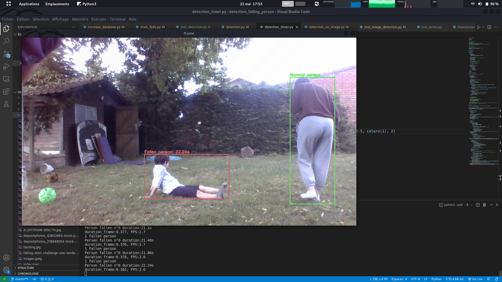
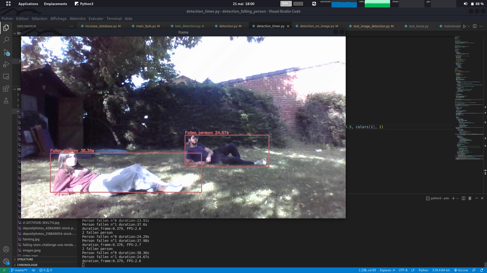
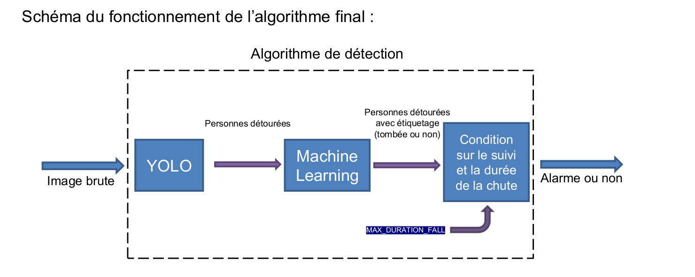

<h1>Fall-detection-with-camera</h1>

<h3>Presentation</h3>

With this program, you can detect people who are falling and start an action when it happens 
You have detection in live on people 

To better detection I had a timer when it exceeds a certain time, it triggers an action ( by default it just rings an alarm )  
we can see the duration of the fall on the screen's top-left corner 

You can even detect multiple person on the same image and even in live with streaming camera

<h3>What do you need</h3>

You will need tensorflow, numpy, opencv  
and also python3, python3-pip 

<code> ~$ sudo apt-get install python3 python3-pip</code> 
<code> ~$ sudo python3 -m pip install numpy tensorflow opencv-python</code> 

And you also need to launch the installation script  
<code> ~$ chmod +x install.sh</code> 
<code> ~$ ./install.sh </code> 

<h3>How to use it</h3>

You have multiple file, you can launch 
but mainly you can use detection.py and detection_timer.py 
The difference between the two is just the number of people you can detect with the one detection.py you can only have one person on the detection 
but you have less needs in computation and the one detection_timer.py you can detect multiple with no problem buuttt you need a little bit more of computation 

So go to the directory where are all the files 

<code> ~$ chmod +x detection.py detection_timer.py</code> 

Then you launch whatever the file you want 
<code> ~$ ./detection.py</code> 
ou 
<code> ~$ ./detection_timer.py</code> 

<h3>How it works</h3>

It uses the algorithm Yolo to detect shape of people and once it detects all the shapes, the shapes of people are passing through an other algorithm 
which I have made and can tell you if those shapes are falling or not 

Algorithm: 

<h3>Why</h3>

I made it for my TIPE which are an exam from Classe Préparatoire to pass some exams 
You can have the presentation in the documentation folder

